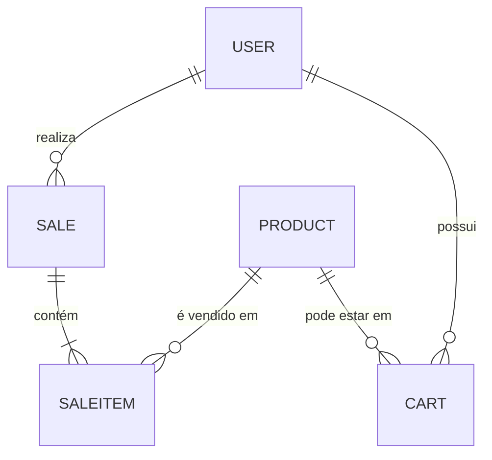

# 🚀 AbiChallenge

## 🟢 Visão Geral

O **AbiChallenge** é um sistema completo para gerenciamento de vendas, produtos, usuários e carrinhos, desenvolvido como parte de um teste técnico. O projeto demonstra habilidades em arquitetura limpa, integração fullstack, boas práticas de engenharia de software e testes automatizados.

O objetivo é oferecer um CRUD robusto de vendas, cadastro de produtos, integração entre frontend (React) e backend (.NET 8), aplicação de regras de negócio (como descontos por quantidade), além de testes unitários e integração. O sistema está pronto para deploy em ambiente containerizado com Docker.

### 🎯 Objetivos Principais

- ✅ **CRUD de vendas** com regras de negócio
- ✅ **Cadastro de produtos** e categorias
- ✅ **Gestão de usuários** e carrinhos
- ✅ **Integração frontend/backend** completa
- ✅ **Testes automatizados** (unitários e integração)
- ✅ **Deploy containerizado** com Docker
- ✅ **Regras de desconto** por quantidade de produtos

---

## 📄 Documentação do Projeto

### Pré-requisitos

- [.NET 8 SDK](https://dotnet.microsoft.com/download)
- [Node.js 18+](https://nodejs.org/)
- [PostgreSQL 15+](https://www.postgresql.org/)
- [Docker](https://www.docker.com/) (opcional, para ambiente containerizado)

### Configuração

1. **Clone o repositório:**
   ```bash
   git clone https://github.com/seu-usuario/AbiChallenge.git
   cd AbiChallenge
   ```

2. **Configurar variáveis de ambiente:**
   - Backend: edite `backend/src/Ambev.DeveloperEvaluation.WebApi/appsettings.Development.json` com sua string de conexão do PostgreSQL.
   - Frontend: (opcional) configure variáveis em `.env` se necessário.

3. **Rodar o backend:**
   ```bash
   cd backend
   dotnet build
   dotnet ef database update # aplica as migrations
   dotnet run --project src/Ambev.DeveloperEvaluation.WebApi
   ```

4. **Rodar o frontend:**
   ```bash
   cd frontend
   npm install
   npm run dev
   ```

5. **Acessar a aplicação:**
   - Frontend: [http://localhost:5173](http://localhost:5173)
   - Backend (Swagger): [http://localhost:5000/swagger](http://localhost:5000/swagger)

### Testes Unitários

- **Backend:**
  ```bash
  cd backend
  dotnet test
  ```
- **Frontend:**
  ```bash
  cd frontend
  npm run test
  ```

### Docker (Opcional)

```bash
# Rodar com Docker Compose
docker-compose up -d

# Ou build individual
docker build -t abichallenge-backend ./backend
docker build -t abichallenge-frontend ./frontend
```

---

## 🛠️ Tecnologias Utilizadas

### Backend
- **.NET 8** - Framework principal
- **Entity Framework Core** - ORM para PostgreSQL
- **AutoMapper** - Mapeamento de DTOs
- **FluentValidation** - Validação de dados
- **xUnit** - Framework de testes
- **Moq** - Mocking para testes
- **Swagger/OpenAPI** - Documentação da API

### Frontend
- **React 18** - Framework JavaScript
- **TypeScript** - Tipagem estática
- **TailwindCSS** - Framework CSS
- **Vite** - Build tool
- **Jest** - Framework de testes
- **React Testing Library** - Testes de componentes

### DevOps & Infraestrutura
- **PostgreSQL** - Banco de dados
- **Docker** - Containerização
- **Docker Compose** - Orquestração de containers

---

## 🗄️ Estrutura de Dados

### Principais Entidades

| Entidade   | Campos Principais                                                                                  | Relacionamentos                |
|------------|---------------------------------------------------------------------------------------------------|--------------------------------|
| User       | id (GUID), username, email, status, role, name, address, createdAt                                | 1:N Sales, 1:N Carts           |
| Product    | id (GUID), title, price, description, category, image, rating                                      | 1:N SaleItems, 1:N CartProducts|
| Sale       | id (GUID), customerId, branchId, items[], subtotal, discountAmount, total, createdAt               | N:1 User, N:1 Branch           |
| SaleItem   | id, productId, quantity, unitPrice, totalPrice                                                     | N:1 Sale, N:1 Product          |
| Cart       | id, userId, products[], createdAt                                                                  | N:1 User                       |
| Branch     | id (GUID), name, city                                                                              | 1:N Sales                      |

### Diagrama Simplificado



### Regras de Negócio - Descontos

- **4+ itens idênticos**: 10% de desconto
- **10-20 itens idênticos**: 20% de desconto
- **Máximo 20 itens** por produto
- **Sem desconto** para quantidades abaixo de 4

---

## 🏛️ Arquitetura

### Padrão: Clean Architecture + DDD

```
┌─────────────────────────────────────────────────────────────┐
│                    PRESENTATION LAYER                      │
│  ┌─────────────────┐  ┌─────────────────┐                │
│  │   Web API       │  │   React App     │                │
│  │   (Controllers) │  │   (Components)  │                │
│  └─────────────────┘  └─────────────────┘                │
└─────────────────────────────────────────────────────────────┘
┌─────────────────────────────────────────────────────────────┐
│                   APPLICATION LAYER                        │
│  ┌─────────────────┐  ┌─────────────────┐                │
│  │   Handlers      │  │   Validators    │                │
│  │   (CQRS)        │  │   (FluentVal)   │                │
│  └─────────────────┘  └─────────────────┘                │
└─────────────────────────────────────────────────────────────┘
┌─────────────────────────────────────────────────────────────┐
│                    DOMAIN LAYER                           │
│  ┌─────────────────┐  ┌─────────────────┐                │
│  │   Entities      │  │   Services      │                │
│  │   (Business)    │  │   (Rules)       │                │
│  └─────────────────┘  └─────────────────┘                │
└─────────────────────────────────────────────────────────────┘
┌─────────────────────────────────────────────────────────────┐
│                 INFRASTRUCTURE LAYER                      │
│  ┌─────────────────┐  ┌─────────────────┐                │
│  │   Repositories  │  │   External      │                │
│  │   (EF Core)     │  │   Services      │                │
│  └─────────────────┘  └─────────────────┘                │
└─────────────────────────────────────────────────────────────┘
```

### Camadas

- **Domain:** Entidades, regras de negócio, interfaces
- **Application:** Casos de uso, handlers, validação
- **Infrastructure:** ORM, repositórios, serviços externos
- **Presentation:** WebAPI (controllers), frontend React

### Boas Práticas

- ✅ **SOLID** - Princípios de design
- ✅ **Separação de responsabilidades** - Cada camada tem sua função
- ✅ **Injeção de dependência** - IoC Container
- ✅ **Testes automatizados** - Unitários e integração
- ✅ **CQRS** - Command Query Responsibility Segregation

### Decisões Técnicas

- **Entity Framework** para acelerar o desenvolvimento e facilitar migrations
- **AutoMapper** para mapeamento de DTOs
- **FluentValidation** para regras de validação
- **xUnit + Moq** para testes unitários
- **React + TypeScript** para frontend robusto

---

## 💻 Aplicação

### Funcionalidades Principais

#### 🛒 Gestão de Vendas
- Criação de vendas com cliente e filial
- Adição de produtos com quantidades
- Cálculo automático de descontos
- Visualização detalhada de vendas
- Edição e exclusão de vendas

#### 📦 Gestão de Produtos
- Cadastro de produtos com categorias
- Upload de imagens
- Sistema de avaliações
- Busca e filtros

#### 👥 Gestão de Usuários
- Cadastro de usuários
- Diferentes perfis (Customer, Manager, Admin)
- Endereços e informações de contato

#### 🛍️ Carrinhos de Compras
- Adição de produtos ao carrinho
- Transformação de carrinho em venda
- Validação de produtos duplicados

### Interface

A aplicação oferece uma interface moderna e responsiva com:

- **Dashboard** com estatísticas
- **Tabelas paginadas** para listagens
- **Modais** para criação/edição
- **Formulários** com validação
- **Busca e filtros** avançados
- **Feedback visual** para ações do usuário

---

## 🧪 Testes Unitários no Backend

### Framework e Ferramentas

- **xUnit** - Framework de testes
- **Moq** - Mocking para dependências
- **FluentAssertions** - Assertions mais legíveis

### Como Rodar

```bash
cd backend
dotnet test

# Com cobertura
dotnet test --collect:"XPlat Code Coverage"
```

### Cobertura de Testes

| Camada | Cobertura | Exemplos |
|--------|-----------|----------|
| **Application** | ✅ Handlers | CreateSaleHandler, UpdateProductHandler |
| **Domain** | ✅ Services | SaleService, UserService |
| **Infrastructure** | ✅ Repositories | ProductRepository, SaleRepository |
| **Validation** | ✅ Validators | CreateSaleValidator, UpdateUserValidator |

### Estrutura de Testes

```
tests/
├── Ambev.DeveloperEvaluation.Unit/
│   ├── Application/
│   │   ├── Sales/
│   │   ├── Products/
│   │   └── Users/
│   ├── Domain/
│   │   ├── Entities/
│   │   ├── Services/
│   │   └── Validation/
│   └── Infrastructure/
│       └── Repositories/
├── Ambev.DeveloperEvaluation.Integration/
└── Ambev.DeveloperEvaluation.Functional/
```

### Exemplo de Teste

```csharp
[Fact]
public async Task CreateSale_WithValidData_ShouldReturnSuccess()
{
    // Arrange
    var command = new CreateSaleCommand
    {
        CustomerId = Guid.NewGuid(),
        BranchId = Guid.NewGuid(),
        Items = new List<CreateSaleItemCommand>
        {
            new() { ProductId = Guid.NewGuid(), Quantity = 5, UnitPrice = 29.99m }
        }
    };

    // Act
    var result = await _handler.Handle(command, CancellationToken.None);

    // Assert
    result.Should().NotBeNull();
    result.Success.Should().BeTrue();
}
```

---

## 🤝 Como Contribuir

### Padrões de Desenvolvimento

- **Branches:**
  - `feature/nome-da-feature`
  - `fix/ajuste-bug`
  - `hotfix/urgente`

- **Commits:**
  ```
  feat: adiciona funcionalidade de desconto por quantidade
  fix: corrige validação de produtos duplicados
  docs: atualiza documentação da API
  test: adiciona testes para SaleService
  ```

- **Pull Requests:**
  - Descreva o que foi feito
  - Relacione issues se aplicável
  - Inclua testes quando necessário

### Checklist para PR

- [ ] Código segue os padrões do projeto
- [ ] Testes passando
- [ ] Documentação atualizada
- [ ] Não quebra funcionalidades existentes

## 🏷️ Badges


---

## 📚 Endpoints Principais

### Autenticação
| Método | Endpoint | Descrição |
|--------|----------|-----------|
| POST | `/api/auth` | Autenticar usuário |

### Produtos
| Método | Endpoint | Descrição |
|--------|----------|-----------|
| GET | `/api/products` | Listar produtos |
| GET | `/api/products/{id}` | Obter produto |
| POST | `/api/products` | Criar produto |
| PUT | `/api/products/{id}` | Atualizar produto |
| DELETE | `/api/products/{id}` | Excluir produto |

### Vendas
| Método | Endpoint | Descrição |
|--------|----------|-----------|
| GET | `/api/sales` | Listar vendas |
| GET | `/api/sales/{id}` | Obter venda |
| POST | `/api/sales` | Criar venda |
| PUT | `/api/sales/{id}` | Atualizar venda |
| DELETE | `/api/sales/{id}` | Excluir venda |

### Usuários
| Método | Endpoint | Descrição |
|--------|----------|-----------|
| GET | `/api/users` | Listar usuários |
| GET | `/api/users/{id}` | Obter usuário |
| POST | `/api/users` | Criar usuário |
| PUT | `/api/users/{id}` | Atualizar usuário |
| DELETE | `/api/users/{id}` | Excluir usuário |

### Carrinhos
| Método | Endpoint | Descrição |
|--------|----------|-----------|
| GET | `/api/carts` | Listar carrinhos |
| GET | `/api/carts/{id}` | Obter carrinho |
| POST | `/api/carts` | Criar carrinho |
| PUT | `/api/carts/{id}` | Atualizar carrinho |
| DELETE | `/api/carts/{id}` | Excluir carrinho |

> Para mais detalhes, acesse o Swagger em `/swagger`.

---

## 🚀 Deploy

### Docker Compose

```yaml
version: '3.8'
services:
  backend:
    build: ./backend
    ports:
      - "5000:5000"
    environment:
      - ConnectionStrings__DefaultConnection=Host=db;Database=AbiChallenge;Username=postgres;Password=password
    depends_on:
      - db

  frontend:
    build: ./frontend
    ports:
      - "3000:3000"
    depends_on:
      - backend

  db:
    image: postgres:15
    environment:
      - POSTGRES_DB=AbiChallenge
      - POSTGRES_USER=postgres
      - POSTGRES_PASSWORD=password
    volumes:
      - postgres_data:/var/lib/postgresql/data

volumes:
  postgres_data:
```

### Comandos de Deploy

```bash
# Build e deploy
docker-compose up -d

# Logs
docker-compose logs -f

# Parar
docker-compose down
```

---

## 📈 Roadmap

### Próximas Funcionalidades

- [ ] **Relatórios** de vendas e analytics
- [ ] **Notificações** em tempo real
- [ ] **API Gateway** para microserviços
- [ ] **Cache** com Redis
- [ ] **Logs** estruturados
- [ ] **Métricas** com Prometheus
- [ ] **CI/CD** com GitHub Actions

### Melhorias Técnicas

- [ ] **Performance** - Otimização de queries
- [ ] **Segurança** - JWT refresh tokens
- [ ] **Testes** - Aumentar cobertura
- [ ] **Documentação** - API docs completos

---

> _Este projeto foi desenvolvido como parte de um desafio técnico e demonstra práticas modernas de desenvolvimento fullstack, arquitetura limpa e testes automatizados!_

---

**⭐ Se este projeto foi útil, considere dar uma estrela no repositório!** 